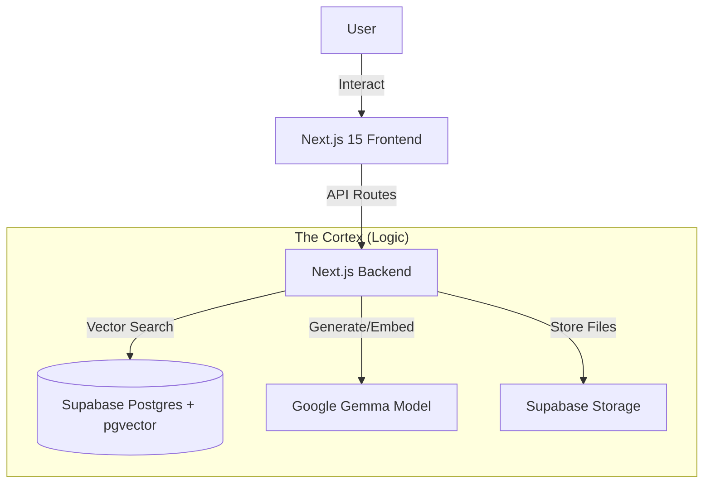
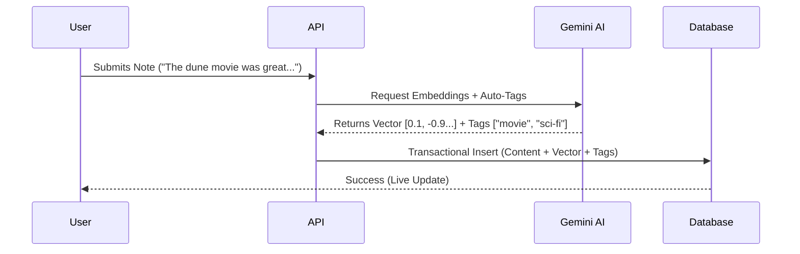
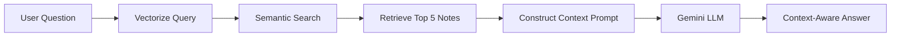

# Second Brain 🧠
**Infrastructure for Thought**

> An intelligent knowledge management platform that leverages AI to capture, organize, and synthesize information into a 3D neural network.

---

## 🌟 Overview
Second Brain isn't just a notes app; it's a thinking partner. It uses **Vector Embeddings** to understand the *meaning* behind your notes, not just the keywords. It features a **Retrieval Augmented Generation (RAG)** chat interface that answers questions based solely on your personal knowledge base, and a **3D Knowledge Graph** to visualize connections between ideas.

## 🎨 Design Principles
We built this system around three core UX pillars:
1.  **Cognitive Ease:** The "Ash & Cream" palette minimizes eye strain, creating a calm environment for deep work.
2.  **Spatial Recall:** Humans remember information spatially. The **3D Force Graph** leverages this by clustering related concepts physically together, mimicking biological neural networks.
3.  **Context Preservation:** The "Sidebar" input pattern allows users to capture new thoughts without losing visual context of their existing dashboard.

---

## 🏗️ Architecture & Workflows

### 1. High-Level Architecture
The system follows a portable, modular architecture separating the "Brain" (Logic) from the "Body" (UI).


### 2. The "Ingest" Pipeline (Input)
How raw text becomes structured knowledge.



### 3. The "Recall" Pipeline (RAG Chat)
How the brain answers questions.



---

## 🛠️ Tech Stack
### Frontend (The Experience)
 - Next.js 15 (App Router): For server-side rendering and swift navigation.
 - Tailwind CSS + Framer Motion: For "fluid" micro-interactions and the parallax hero.
 - React Force Graph 3D: Using CSS3DRenderer to render HTML cards in WebGL space.

### Backend (The Intelligence)
 - Supabase (PostgreSQL): Storing structured data and JSON metadata.
 - pgvector: Enabling cosine similarity search for semantic retrieval.
 - Supabase Storage: Managing file attachments and media.

### AI (The Engine)
 - Google Gemma 3: Used for high-speed text generation.
 - Google Text-Embedding-004: Used to generate vector embedding.

---

### 🌐 Live Demo
Experience the platform here: [**second-brain-gx2a.onrender.com**](https://second-brain-gx2a.onrender.com)

---

## 🚀 Getting Started

### 1. Clone & Install
First, bring the project to your local machine and install the necessary dependencies:

```bash
git clone https://github.com/Jay0073/second-brain.git
cd second-brain
npm install
```

### 2. Environment Setup
Create a .env.local file in the root directory and add your credentials:
```bash
# Supabase Configuration
NEXT_PUBLIC_SUPABASE_URL="your_supabase_project_url"
NEXT_PUBLIC_SUPABASE_ANON_KEY="your_supabase_project_anon_key"
PUBLISHABLE_API_KEY="publishable_key_from_supabase_project"

# AI Configuration
GEMINI_API_KEY="your_gemini_api_key"
```

### 3. Run Development
Start the local development server to see the app in action:
```bash
npm run dev
```

Open http://localhost:3000 with your browser to see the result.

---


## 🖼 Screenshots

### Dashboard View


### 3D Graph Visualization


### AI Chatbot


### New Note Creation

